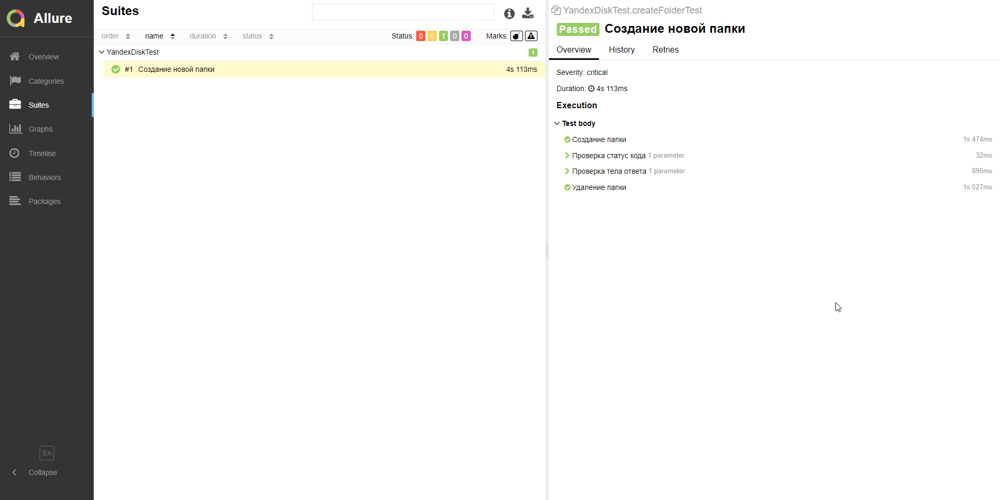

# YandexApi
Тетирование API Яндекс диска.
Проверка возможности создания новой папки

Запуск:

 -mvn clean test 

 Запуск Allure отчета:

 -mvn clean verify allure:serve 

 Задействованы инструменты:
<ul>
<li>Java (JDK17)</li>
<li>Maven</li>
<li>Junit4</li>
<li>RestAssured</li>
<li>Allure</li>

</ul>
